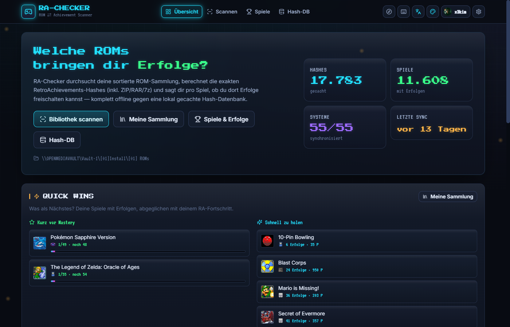
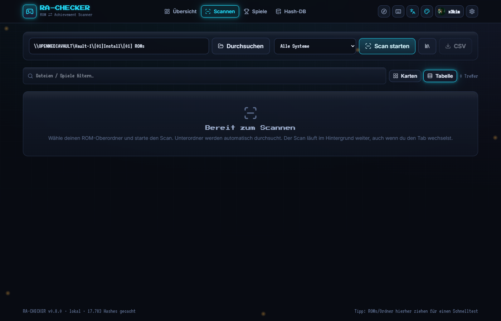

# 🎮 RAChecker

**Prüfe deine ROM-Sammlung gegen RetroAchievements — finde heraus, bei welchen Spielen du Erfolge holen kannst.**

RAChecker durchsucht deinen sortierten ROM-Oberordner (inkl. aller Unterordner),
berechnet pro Datei den **exakten RetroAchievements-Hash** und sagt dir sofort, ob
dieses ROM mit den Achievements kompatibel ist. Komplett **offline** gegen eine lokal
gecachte Hash-Datenbank — nach der ersten Synchronisierung braucht ein Scan **keine
einzige API-Anfrage** mehr.

   

🇬🇧 [English version](README.md)

> **RAChecker ist ein inoffizielles, unabhängiges Community-Projekt und steht in keiner Verbindung zu RetroAchievements.** Es liefert **keine** ROMs. Spiel-Daten, Hashes und Bilder stammen von [retroachievements.org](https://retroachievements.org) und bleiben deren Eigentum. RAChecker läuft rein lokal, sammelt keine Daten und sendet nichts an Dritte; dein API-Key bleibt auf deinem Rechner.

---

<p align="center">
  
  
</p>

---

## ✨ Was es kann

- **Erst-Start-Assistent** — ROM-Ordner, RA-Login und Hash-Sync in drei geführten Schritten.
- **Ganze Bibliothek scannen** — einen Oberordner angeben, alle Unterordner werden rekursiv durchsucht.
- **Läuft im Hintergrund** — der Scan/Sync läuft weiter, auch wenn du den Tab wechselst (kein Abbruch mehr).
- **Saubere Filter** — `._*`-Reste (macOS), versteckte Dateien und Junk (`.txt/.nfo/.sav/.png` …) werden automatisch übersprungen.
- **Merkt sich alles** — jede geprüfte Datei landet dauerhaft in deiner **Sammlung**; unveränderte Dateien werden beim Re-Scan **nicht neu gehasht** (Hash-Cache nach Pfad+Größe+Datum).
- **Sammlung-Ansicht** — durchsuch- und filterbare Liste aller je gescannten ROMs, mit Status pro System, Mehrfachauswahl (löschen/Pfade kopieren) und RetroArch-`.lpl`-Export.
- **Sammlung-Diff** — zeigt nach jedem Scan, was neu ist, jetzt Erfolge hat, verloren oder verschwunden ist.
- **Spiele & Erfolge browsen** — global suchen oder pro System; alle Achievements mit Badges, Punkten und kompatiblen ROM-Versionen.
- **Dein RA-Fortschritt** — Mastery-Tab + pro Spiel: welche Erfolge du schon hast, Completion %, Avatar & „gerade gespielt".
- **Hardcore-Aufholliste** — zeigt pro Spiel, wie weit dein Hardcore-Fortschritt dem Softcore-Fortschritt hinterherhängt (eigene ROMs zuerst). Jeder Softcore-Erfolg lässt sich in Hardcore erneut holen — nur der zählt für goldene Abzeichen, Ranglisten und volle Punkte.
- **Entdecken-Tab** — drei Ansichten für die RA-Welt jenseits der eigenen Sammlung:
  - *Gratis-Spiele*: die von RetroAchievements kuratierte Liste legal kostenloser Homebrew-/Freeware-Titel (91 Spiele, 10 Systeme), abgeglichen mit deiner Sammlung — inklusive Download-Link zum Original. Es werden **keine ROMs mitgeliefert**, nur Verweise.
  - *Set-Radar*: welche Achievement-Sets gerade gebaut werden (aktive Claims), getrennt nach „betrifft ein Spiel, das du besitzt", „betrifft wahrscheinlich eine deiner ROMs" und Rest; dazu deine eigenen Set-Anfragen und deine „Will ich spielen"-Liste.
  - *Community*: Achievement der Woche und frisch gemeisterte Spiele — jeweils markiert, ob du das Spiel hast.
- **Ranglisten** — pro Spiel alle RA-Leaderboards samt deinem eigenen Eintrag und Platz (gelten nur im Hardcore-Modus).
- **Spielzeit-Tracking (opt-in)** — fragt per Rich Presence ab, was du gerade spielst, und baut daraus eine lokale Session- und Spielzeit-Historie; RetroAchievements selbst speichert so etwas nicht. Standardmäßig aus.
- **Direkt starten** — ROMs aus der Sammlung mit einem Klick in RetroArch öffnen, inklusive Core-Empfehlung pro System (mit Vermerk, ob der Core Achievements bzw. Hardcore unterstützt).
- **RA-Weltabdeckung** — wie viel Prozent aller RA-Spiele, -Achievements und -Punkte deine Sammlung abdeckt, pro System aufgeschlüsselt.
- **Offline-Paket** — Hash-DB, Spieldetails und Bildcache als ein Archiv exportieren/importieren (zweiter Rechner oder Vollbackup), plus Bereitschaftscheck „läuft alles ohne Internet?".
- **Launcher-Exporte** — neben RetroArch-Playlists (`.lpl`) auch ES-DE/EmulationStation (ZIP mit einer `gamelist.xml` pro System und relativen Pfaden), Playnite (CSV) und LaunchBox (XML), jeweils mit den offiziellen Plattform-Namen des Ziel-Launchers.
- **Neue Systeme** — nach einem Sync wird gemeldet, welche Systeme RetroAchievements seit dem letzten Mal neu unterstützt.
- **Drag & Drop** — ROMs/Ordner ins Fenster ziehen → Upload-Schnelltest gegen die Hash-DB (Temp danach gelöscht).
- **Richtige Version finden** — bei KEIN MATCH den Dateinamen aufs Spiel matchen und die akzeptierten Versionen + Patches anzeigen.
- **Kompatibilitäts-Patches** — RAPatches-Downloadlinks pro ROM-Version (Patch auf Basis-ROM → passender Hash → Erfolge).
- **Duplikate (1G1R)** — gleiches Spiel von mehreren Dateien erkannt und gruppiert, Extra-Kopien direkt löschbar (behält die erste Datei).
- **Ordner-Watch** — optional den ROM-Ordner überwachen; wählbar zwischen Dauer-Watch und Intervall-Modus (alle N Minuten kurz prüfen), standardmäßig aus.
- **Geplante Scans** — täglich zu einer festen Uhrzeit automatisch scannen (an/aus, Einstellungen).
- **Scan-Filter** — auf ein einzelnes System beschränken; „Im Explorer anzeigen" pro Treffer; Systemauswahl legt fest, welche Systeme Sync & Scan überhaupt beachten.
- **55+ Systeme** — von NES/SNES/Mega Drive über Game Boy/GBA bis PlayStation, Saturn, Dreamcast, Arcade …
- **Archive direkt** — `.zip`, `.rar`, `.7z` werden gelesen **ohne** manuelles Entpacken. ZIP-Inhalte werden im Speicher gehasht (kein Temp-Müll); 7z/RAR werden in einen Temp-Ordner extrahiert und **danach automatisch gelöscht**. Archiv-Inhalte werden ebenfalls gecacht. Große Dateien können vor dem Hashen optional lokal zwischenkopiert werden (Schwelle einstellbar, gegen Timeouts auf langsamen Netzlaufwerken).
- **Korrekte Hashes** — pro System wird die echte RetroAchievements-Methode nachgebildet (iNES-Header strippen, SNES-Copier-Header, N64-Byteswap, Arcade = Dateiname-Hash …). Disc-Systeme & `.chd` via offiziellem **RAHasher**.
- **Aggressives Caching** — die komplette Hash-Datenbank wird lokal in SQLite gespeichert. Re-Sync erst nach **90 Tagen** (oder per Klick). System-, Spiel- und Erfolgs-Bilder werden ebenfalls lokal gecacht (inkl. Vorab-Cache für Badges/Boxart).
- **Schonend zur API** — eingebauter Rate-Limiter; pro System nur **eine** Anfrage (Bulk-Endpoint), statt einer pro ROM.
- **Live-Fortschritt** — Server-Sent-Events zeigen jeden Treffer in Echtzeit, mit Box-Art, Erfolgszahl und Punkten.
- **Automatische Backups** — die Datenbank wird beim Start und nach jedem Scan gesichert; manuell sichern, herunterladen oder wiederherstellen in den Einstellungen.
- **Speicher-Übersicht** — sehen, wie viel Datenbank, Bilder, Backups & Temp belegen, inkl. „Temp leeren".
- **Befehlspalette (Strg+K)** und **Tastatur-Shortcuts** (`g` + Taste zur Navigation, `/` für Suche, `?` für Hilfe).
- **Geführte Tour** durch die Oberfläche, erreichbar über das Kompass-Symbol.
- **Deutsch/Englisch** umschaltbar, komplette Oberfläche übersetzt.
- **6 Designs** (CRT Cyan, Amber Terminal, Synthwave, Matrix, Game Boy, Light) + 2 geheime Freischaltungen, dazu 3 Schriftarten und ein optionaler Aurora-Hintergrund — frei wählbar, lokal gespeichert.
- **CSV-Export** der Scan- und Sammlung-Ergebnisse.
- **Auch als Desktop-App** — optionaler Electron-Build für Windows, siehe [docs/BUILDING.md](docs/BUILDING.md).
- **Schicke Retro-CRT-Oberfläche** 🕹️

---

## 🚀 Schnellstart

### Variante A — Doppelklick (Windows)
1. [Node.js 22.5+](https://nodejs.org) installieren.
2. **`Start-RAChecker.bat`** doppelklicken.
   Beim ersten Start werden Abhängigkeiten installiert und die Oberfläche gebaut (einmalig, dauert etwas). Danach öffnet sich automatisch <http://localhost:8088>.

### Variante A' — Doppelklick (Linux/macOS)
1. [Node.js 22.5+](https://nodejs.org) installieren.
2. **`./start.sh`** ausführen (`chmod +x start.sh` falls nötig).
   Installiert Abhängigkeiten, baut die Oberfläche und startet den Server auf <http://localhost:8088>. Disc-Systeme brauchen dort ein selbst gebautes RAHasher (siehe Abschnitt „Disc-Systeme & RAHasher" unten).

### Variante B — Terminal (alle Plattformen)
```bash
npm install          # einmalig
npm run serve        # baut das Frontend und startet den Server
# -> http://localhost:8088
```

### Entwicklung (mit Hot-Reload)
```bash
npm run dev          # Backend (watch) + Vite-Devserver auf :5173
```

---

## 🧭 Bedienung

1. **Hash-DB** → **Synchronisieren.** Holt pro System einmalig alle Spiele + Hashes von
   RetroAchievements (dauert beim ersten Mal ein paar Minuten — danach im Cache).
2. **Scannen** → ROM-Oberordner wählen (beim allerersten Start fragt der Onboarding-Assistent danach; kein Pfad vorbelegt) → **Scan starten.**
   Ergebnisse erscheinen live:
   | Status | Bedeutung |
   |---|---|
   | 🟢 **SPIELBAR** | Hash matcht — hier kannst du Erfolge holen |
   | 🔴 **KEIN MATCH** | Diese ROM-Version ist RA unbekannt — kein Cheevo-Support |
   | 🟡 **RAHASHER** | Disc-System/`.chd` — braucht das RAHasher-Tool (siehe unten) |
   | 🟣 **UNKLAR** | System nicht eindeutig erkennbar (z. B. lose `.bin` ohne System-Ordner) |
3. Auf eine grüne Zeile klicken → Details (Erfolge, Punkte, Referenz-ROM-Name, voller Hash, Link zu RA).
4. Filtern nach Status/System, suchen, als **CSV exportieren.**

> **Tipp:** Sortiere deine ROMs in nach System benannte Ordner (`SNES`, `PlayStation`, `Game Boy` …).
> RAChecker nutzt den Ordnernamen, um mehrdeutige Endungen wie `.bin`/`.iso`/`.cue` eindeutig zuzuordnen.

---

## 💿 Disc-Systeme & RAHasher

Cartridge-Systeme (NES, SNES, Mega Drive, GB/GBA, N64 …) werden komplett in-process gehasht.
**Disc-basierte** Systeme (PS1, PS2, PSP, Saturn, Dreamcast, Sega-CD, PCE-CD, 3DO, GameCube, Wii, DS …)
und komprimierte **`.chd`**-Images brauchen das offizielle **RAHasher**-Tool von RetroAchievements
(das die korrekten Disc-Hashes berechnet, inkl. CHD-Unterstützung).

→ **Einstellungen → RAHasher herunterladen.** Holt automatisch das aktuelle Windows-Binary aus dem
[RALibretro-Release](https://github.com/RetroAchievements/RALibretro/releases) und legt es unter `bin/` ab.
Ohne RAHasher werden Disc-Spiele als 🟡 **RAHASHER** markiert (nicht als Fehler).

Der Auto-Download funktioniert nur unter Windows. Auf Linux/macOS RAHasher selbst aus
[RALibretro](https://github.com/RetroAchievements/RALibretro) bauen (dort sind auch Linux/Mac-Build-Anleitungen)
und den Pfad in den Einstellungen unter `rahasherPath` eintragen.

---

## 🖥️ Desktop-App

RAChecker läuft normal als lokale Web-App, lässt sich für Windows aber auch zu einer
eigenständigen **Desktop-App** bauen (Electron; ein Fenster, kein Browser-Tab, kein Terminal):

```bash
npm run app:dev     # Testlauf direkt aus dem Repo
npm run app:dist     # Installer + Portable-EXE in release/
```

Details, Datenablage und Grenzen: [docs/BUILDING.md](docs/BUILDING.md).

---

## ⚙️ Konfiguration

Standardwerte stehen in [`server/src/config.js`](server/src/config.js). Zum dauerhaften Überschreiben
(empfohlen für Zugangsdaten): [`server/config.local.example.json`](server/config.local.example.json)
nach `server/config.local.json` kopieren und anpassen (git-ignoriert).

| Schlüssel | Standard | Bedeutung |
|---|---|---|
| `raUsername` / `raApiKey` | (leer) | RetroAchievements Web-API-Zugang — wird über den Onboarding-Assistenten/Einstellungen gesetzt (in der DB gespeichert) |
| `romRoot` | (leer) — wird beim ersten Start/Onboarding gesetzt | Scan-Pfad |
| `port` / `host` | `8088` / `127.0.0.1` | Server bindet nur lokal |
| `hashCacheTtlDays` | `90` | nach so vielen Tagen wird ein System neu synchronisiert |
| `rateLimit.minIntervalMs` | `500` | min. Abstand zwischen API-Anfragen (≈ 2/s) |
| `rahasherPath` | *(auto)* | Pfad zu RAHasher.exe (sonst `bin/` + PATH) |

Alternativ per Umgebungsvariable: `RA_USERNAME`, `RA_API_KEY`, `RA_ROM_ROOT`, `PORT`, `RA_DATA_DIR`, `RA_RAHASHER`.

Den Web-API-Key findest du unter [retroachievements.org → Settings](https://retroachievements.org/settings),
dort im Reiter **„Keys"** den Web API Key anzeigen/generieren lassen.

---

## 🛠️ Wie es funktioniert (Kurzfassung)

```
ROM-Datei ──► System erkennen (Ordnername + Endung)
          ──► Hash berechnen   (rcheevos-Regeln in JS  |  RAHasher für Disc/CHD)
          ──► Lookup in lokaler SQLite-Hash-DB
          ──► 🟢 Treffer (Spiel + Erfolge)  /  🔴 kein Treffer
```

- **Hash-DB** kommt 1×/System via `API_GetGameList?h=1&f=1` (alle Spiele + MD5s in einer Anfrage) und
  liegt in `data/ra-checker.db`. Matching ist danach rein lokal → **0 API-Calls pro Scan.**
- **Datei-Hash-Cache**: Eine einmal gehashte Datei (Pfad + Größe + Änderungszeit) wird nicht erneut gehasht.
- Details: [`docs/HASHING.md`](docs/HASHING.md) · [`docs/ARCHITECTURE.md`](docs/ARCHITECTURE.md) · [`docs/USAGE.md`](docs/USAGE.md)

---

## 📁 Projektstruktur

```
RAChecker/
├─ Start-RAChecker.bat      # Windows-Launcher (Doppelklick)
├─ start.sh                  # Linux/macOS-Launcher
├─ server/                   # Backend (Fastify, node:sqlite — keine nativen Deps)
│  └─ src/
│     ├─ index.js            # Server-Start, serviert das gebaute Frontend
│     ├─ config.js           # Konfiguration + Defaults
│     ├─ db.js               # SQLite-Schema + Queries
│     ├─ routes.js           # HTTP-/SSE-Routen (die eigentliche API)
│     ├─ sse.js              # Server-Sent-Events-Hilfsfunktionen
│     ├─ ra-api.js           # RA-Web-API-Client + Rate-Limiter
│     ├─ sync.js             # Hash-DB-Synchronisierung (90-Tage-TTL)
│     ├─ scanner.js          # rekursiver Scanner + Konsolen-Erkennung
│     ├─ consoles.js         # System-Metadaten (Hash-Methode, Endungen, Aliase)
│     ├─ images.js           # Bild-Cache
│     ├─ fs-browse.js        # Server-Ordner-Browser (Ordner-Picker-Backend)
│     ├─ watcher.js          # Ordner-Überwachung (Dauer- + Intervall-Modus)
│     ├─ scheduler.js        # geplanter täglicher Scan
│     ├─ scan-lock.js        # verhindert parallele Scans (manuell/Watch/Zeitplan)
│     ├─ presence.js         # Rich-Presence-Abfrage → lokale Spielzeit-Sessions
│     ├─ launch.js           # ROM im konfigurierten Emulator starten (Core-Auflösung)
│     ├─ offline.js          # Offline-Paket exportieren/importieren + Bereitschaftscheck
│     ├─ data/               # gebündelte Datentabellen (Gratis-Spiele-Katalog, RetroArch-Cores)
│     └─ hashing/            # file-hash | archive | rahasher | dispatcher
├─ web/                      # Frontend (Vite + React + Tailwind v4)
├─ electron/                 # Desktop-App-Wrapper (main.mjs, siehe docs/BUILDING.md)
├─ scripts/                  # Build-Hilfsskripte (z. B. Icon-Generator)
├─ build/                    # Electron-Build-Ressourcen (Icon etc.)
├─ .github/                  # CI-Workflow (Tests + Build auf Windows/Linux)
├─ docs/                     # Architektur, Hashing-Regeln, Bedienung, Desktop-Build
└─ data/                     # Laufzeit: DB, Bild-Cache, Backups, Temp (git-ignoriert)
```

---

## ✅ Tests

```bash
npm test     # Korrektheit der Hashing-Regeln (NES/SNES/N64/Lynx/7800/PCE/Arduboy/Arcade)
```

Die Hash-Regeln sind über beweisbare Invarianten getestet (z. B. N64 `z64`/`v64`/`n64`
desselben ROMs müssen identisch hashen). End-to-End wurde gegen **echte** RA-Daten
verifiziert (Arcade-Treffer, Cartridge-Erkennung, ZIP-Expansion, `.chd` → RAHasher).

---

## 🔄 Aktualisieren

1. Neuen Code holen: `git pull` (oder das aktuelle ZIP über den bestehenden Ordner entpacken).
2. `npm install` — nötig, falls sich Abhängigkeiten geändert haben.
3. Neu starten (`Start-RAChecker.bat` / `./start.sh` / `npm run serve`) — das Frontend wird dabei automatisch neu gebaut.

`data/` (Sammlung, Backups, Bild-Cache, Einstellungen) ist git-ignoriert und bleibt beim Aktualisieren unangetastet.

## ⚠️ Hinweise

- RAChecker liest nur — es verändert oder verschiebt **keine** ROMs.
- Es werden **keine ROMs** mitgeliefert; du brauchst deine eigenen Dateien.
- Nicht mit RetroAchievements affiliiert. Spiel-Daten, Hashes und Bilder © [retroachievements.org](https://retroachievements.org).
- Der Server bindet nur an `127.0.0.1` (nicht im Netzwerk erreichbar).
- **Sicherheit:** CORS ist auf `localhost`/`127.0.0.1` beschränkt (kein offenes `origin: true`), `/api/image` akzeptiert ausschließlich RetroAchievements-Bild-Hosts (kein offener Bild-Proxy), und ein Scan-Lock verhindert, dass manueller Scan, Ordner-Watch und geplanter Scan gleichzeitig über denselben Ordnerbaum laufen.
- Alle Schriftarten sind lokal gebündelt (`web/public/fonts`) — RAChecker lädt nichts von Google Fonts oder anderen CDNs, funktioniert also komplett offline im Browser.

## 🧱 Bekannte Grenzen

- RAR wird komplett in den Speicher geladen (große RAR-Disc-Images: lieber `.chd`/`.7z`).
- `.cdi`/`.toc` ggf. nach `.cue`/`.chd` konvertieren.
- Der automatische RAHasher-Download unterstützt nur Windows; auf Linux/macOS muss RAHasher selbst aus [RALibretro](https://github.com/RetroAchievements/RALibretro) gebaut werden.
- Der Electron-Installer ist unsigniert (SmartScreen-Warnung beim ersten Start) — siehe [docs/BUILDING.md](docs/BUILDING.md).

## 🤝 Mitmachen

Setup, Tests und Konventionen: [CONTRIBUTING.md](CONTRIBUTING.md). Der eigene Code steht unter der
[MIT-Lizenz](LICENSE); Spiel-Daten, Hashes und Bilder bleiben © retroachievements.org (nicht Teil der Lizenz).
