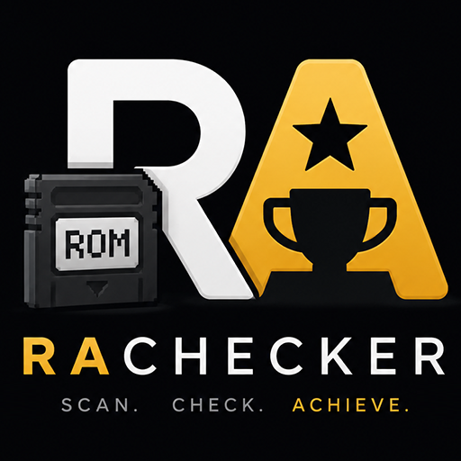

<p align="center">
  
</p>

<h1 align="center">RAChecker</h1>

<p align="center">
  <b>Finde heraus, mit welchen deiner ROMs du RetroAchievements sammeln kannst.</b><br>
  Zeig auf deinen ROM-Ordner — RAChecker hasht jede Datei genau so wie RetroAchievements<br>
  und sagt dir, welche Spiele unterstützt werden.
</p>

<p align="center">
  <a href="https://github.com/x3kim/RAChecker/releases/latest"></a>
  &nbsp;
  <a href="https://github.com/x3kim/RAChecker/releases"></a>
  &nbsp;
  <a href="https://x3kim.github.io/RAChecker/"></a>
</p>

<p align="center">
  
  
  
  
  
</p>

<p align="center">
  🇬🇧 <a href="README.md">English version</a> · 📖 <a href="https://x3kim.github.io/RAChecker/">Dokumentation</a> · 💬 <a href="https://github.com/x3kim/RAChecker/issues">Issues</a>
</p>

> **Inoffizielles Community-Projekt — nicht mit RetroAchievements affiliiert.** Es werden **keine ROMs** mitgeliefert.
> Spieldaten, Hashes und Bilder stammen von [retroachievements.org](https://retroachievements.org) und bleiben deren Eigentum.
> Alles läuft lokal; dein API-Key verlässt deinen Rechner nicht.

> [!IMPORTANT]
> **Die Android-App ist noch jung und an den Rändern rau.** Sie funktioniert, aber du solltest wissen, was dich erwartet:
> - **Große Dateien dauern Minuten.** Das Entpacken läuft in JavaScript, ein mehrere Gigabyte großes Disc-Image
>   in einer `.7z` kann am Handy also einige Minuten brauchen (gemessen: 1,6-GB-Image ≈ 1,5 min am PC, am
>   älteren Handy spürbar länger). Der Scan zeigt den Entpack-Fortschritt — es arbeitet, es hängt nicht.
>   Für große Sammlungen ist die Desktop-App deutlich schneller.
> - **Disc-Systeme synchronisieren.** Disc-Images können nur treffen, wenn du diese Systeme im Tab
>   **Hash-DB** ausgewählt und synchronisiert hast.
> - **Noch nicht unterstützt:** RAR-Archive, GameCube/Wii, CSO/RVZ/GCZ/GDI, geteilte CUE/BIN und M3U sowie
>   CHDs, deren Daten FLAC-komprimiert sind. Dafür weiterhin die Desktop-App.
>
> Fehlerberichte sind sehr willkommen — gerne ein [Issue](https://github.com/x3kim/RAChecker/issues) aufmachen.

---

<p align="center">
  
  
</p>

---

## Inhalt

- [Zwei Apps](#zwei-apps) · [Schnellstart](#schnellstart) · [Wie es funktioniert](#wie-es-funktioniert)
- [Funktionen](#funktionen) · [Android-App](#android-app) · [Disc-Systeme](#disc-systeme)
- [Konfiguration](#konfiguration) · [Projektstruktur](#projektstruktur) · [Hinweise & Grenzen](#hinweise--grenzen)

---

## Zwei Apps

|  | 🖥️ **Desktop** (Windows/Linux/macOS) | 📱 **Android** |
|---|---|---|
| **Wofür** | Die ganze ROM-Sammlung scannen | ROMs am Handy prüfen |
| **Braucht** | Node 22.5+ oder den fertigen Installer | Nichts — eigenständige APK |
| **Cartridge-ROMs** | ✅ | ✅ |
| **Disc-Images** | ✅ alle Formate (via RAHasher) | ✅ CHD, ISO, PBP — direkt am Handy |
| **Archive** | ✅ ZIP, 7z, RAR | ✅ ZIP, 7z |
| **DAT-Abgleich** | ✅ | — |
| **Im Emulator starten** | ✅ | — |

Beide gleichen deine ROMs **komplett offline** gegen eine einmalig synchronisierte Hash-Liste ab.

---

## Schnellstart

<table>
<tr><th>Windows</th><th>Linux / macOS</th><th>Alle Plattformen</th></tr>
<tr valign="top">
<td>

[Installer](https://github.com/x3kim/RAChecker/releases/latest) laden,
**oder** aus dem Quellcode:

1. [Node.js 22.5+](https://nodejs.org) installieren
2. **`Start-RAChecker.bat`** doppelklicken

</td>
<td>

1. [Node.js 22.5+](https://nodejs.org) installieren
2. **`./start.sh`** ausführen
   (vorher `chmod +x start.sh`)

</td>
<td>

```bash
npm install
npm run serve
```

</td>
</tr>
</table>

Läuft dann auf **<http://localhost:8088>**. Beim ersten Start werden einmalig die
Abhängigkeiten installiert und die Oberfläche gebaut.

**Danach:** Der Einrichtungs-Assistent führt dich durch alles — ROM-Ordner wählen,
RetroAchievements-Konto verbinden, Hash-Liste synchronisieren. Ab dann braucht ein Scan
**null API-Anfragen**.

<details>
<summary>Entwicklung (mit Hot Reload)</summary>

```bash
npm run dev     # Backend (watch) + Vite-Dev-Server auf :5173
npm test        # Tests der Hash-Regeln
```
</details>

---

## Wie es funktioniert

```
ROM-Datei ──► alle plausiblen RetroAchievements-Hashes berechnen
          ──► jeden in der lokalen SQLite-Hash-DB nachschlagen
          ──► 🟢 Treffer (Spiel + Erfolge)   🔴 nicht bei RetroAchievements
```

Der **Hash** ist kein simples MD5 der Datei — jedes System hat seine eigene Regel
(iNES-Header entfernen, SNES-Copier-Header entfernen, N64-ROMs byte-swappen, die
Boot-Datei aus einer PlayStation-Disc lesen …). RAChecker bildet diese Regeln exakt nach,
damit das Ergebnis dem entspricht, was RetroAchievements erwartet.

Weil die vollständige Hash-Liste lokal liegt, werden Dateien **anhand ihres Inhalts** erkannt —
nicht anhand von Ordnernamen. Ein korrekt gedumptes ROM trifft, egal wie du sortierst.

- Hash-Liste: eine Anfrage pro System (`API_GetGameList`), gespeichert in `data/ra-checker.db`, Neusync nach 90 Tagen.
- Datei-Cache: einmal gehasht (Pfad + Größe + Datum) heißt nie wieder hashen.
- Details: [HASHING.md](docs/HASHING.md) · [ARCHITECTURE.md](docs/ARCHITECTURE.md) · [USAGE.md](docs/USAGE.md)

---

## Funktionen

### 🔍 Scannen & Abgleich

- **Ganze Sammlung auf einmal** — auf einen Wurzelordner zeigen, alle Unterordner werden durchsucht.
- **Erkennung am Inhalt** — für jede Datei werden alle plausiblen Hashes berechnet und nachgeschlagen; der, den die Datenbank kennt, bestimmt Spiel *und* System. Ordnernamen sind egal.
- **55+ Systeme** — NES/SNES/Mega Drive, Game Boy/GBA, N64, PlayStation, Saturn, Dreamcast, Arcade und mehr.
- **Archive direkt lesbar** — `.zip`, `.7z`, `.rar` ohne manuelles Entpacken; Inhalte werden ebenfalls gecacht.
- **Müll wird übersprungen** — `._*`-Reste, versteckte Dateien, Saves, Bilder und Textdateien.
- **Merkt sich alles** — unveränderte Dateien werden nicht neu gehasht; auf Wunsch tauchen bereits erfasste Dateien beim Neu-Scan gar nicht mehr auf.
- **Läuft im Hintergrund** — Tab-Wechsel unterbricht Scan oder Sync nicht.
- **Live-Fortschritt** — jeder Treffer erscheint sofort mit Boxart, Erfolgs-Anzahl und Punkten.

### 🏆 Dein RetroAchievements-Fortschritt

- **Profil & Mastery** — Fortschritt pro Spiel, Avatar, zuletzt gespielt.
- **Schnelle Erfolge** — Spiele aus deiner Sammlung, bei denen du der Mastery am nächsten bist.
- **Hardcore-Rückstand** — wie weit Hardcore pro Spiel hinter Softcore liegt (nur Hardcore zählt für goldene Badges und Bestenlisten).
- **Bestenlisten** — jede Leaderboard pro Spiel inklusive deinem eigenen Rang.
- **Spielzeit-Tracking (optional, standardmäßig aus)** — baut aus Rich Presence eine lokale Sitzungs-Historie; RetroAchievements selbst speichert so etwas nicht.

### 🧭 Entdecken

- **Gratis-Spiele** — legal kostenlose Homebrew-/Freeware-Titel, kuratiert von RetroAchievements (91 Spiele, 10 Systeme), abgeglichen mit deiner Sammlung. Links führen zu den Entwicklerseiten — **es werden keine ROMs mitgeliefert**.
- **Set-Radar** — welche Achievement-Sets gerade gebaut werden, sortiert danach, ob sie ein Spiel von dir betreffen; dazu deine Set-Anfragen und deine „Want to Play"-Liste.
- **Community** — Achievement der Woche und frisch gemeisterte Spiele, jeweils markiert, ob du sie besitzt.
- **Neue Systeme** — nach einem Sync siehst du, welche Systeme RetroAchievements neu unterstützt.

### 📚 Sammlung verwalten

- **Sammlungs-Ansicht** — durchsuch- und filterbare Liste aller je gescannten ROMs, mit Mehrfachauswahl.
- **Sammlungs-Diff** — nach jedem Scan: was ist neu, neu spielbar, verloren oder weg.
- **DAT-Abgleich** — No-Intro-/Redump-/logiqx-/ClrMamePro-/MAME-Kataloge importieren und pro Katalog sehen, was du hast und was fehlt (exportierbar). Abgeglichen über echte Prüfsummen, die *ohne Entpacken* direkt aus Archiven gelesen werden — unabhängig vom RetroAchievements-Hash. Inklusive Ansicht für unbekannte Dumps.
- **Wunsch-Region & Sprache** — Region und Sprachen, die in ROM-Dateinamen stecken (No-Intro, GoodTools, TOSEC, Übersetzungs-Tags), werden gelesen und als Kürzel angezeigt. Leg deine Reihenfolge fest (z. B. *Japanisch → Japan → Europa*): danach sortiert die Sammlung, bei Duplikaten wird die Kopie zum Behalten markiert, und die Spiel-Details zeigen, welche Regionen RetroAchievements unterstützt und welche davon du schon hast. Die Sammlung lässt sich nach jeder Region oder Sprache filtern. Es wird dadurch nie etwas ausgeblendet oder gelöscht.
- **Duplikate (1G1R)** — dasselbe Spiel in mehreren Dateien wird gruppiert; Extra-Kopien direkt löschbar, deine Wunsch-Region bleibt.
- **Passende Version finden** — bei einem Fehltreffer wird der Dateiname dem Spiel zugeordnet und die akzeptierten Versionen + RAPatches-Links werden gezeigt.
- **RA-Weltabdeckung** — welchen Anteil aller RA-Spiele, -Erfolge und -Punkte deine Sammlung abdeckt, pro System.
- **Exporte** — RetroArch `.lpl`, ES-DE/EmulationStation, Playnite, LaunchBox, CSV.
- **Offline-Paket** — Hash-DB, Spieldetails und Bild-Cache als ein Archiv exportieren/importieren.

### ⚙️ Automatik & Komfort

- **Ordner-Überwachung** — optional; dauerhaft oder alle N Minuten. Standardmäßig aus.
- **Geplante Scans** — einmal täglich zu einer festen Uhrzeit.
- **In RetroArch starten** — ein Klick aus der Sammlung, mit Core-Empfehlung pro System.
- **Drag & Drop** — ROMs irgendwo ablegen für eine Schnellprüfung (Temp-Dateien werden danach gelöscht).
- **Automatische Backups** — beim Start und nach jedem Scan; manuell sichern, herunterladen und wiederherstellen in den Einstellungen.
- **Speicher-Übersicht** — wie viel Platz Datenbank, Bilder, Backups und Temp belegen, mit Aufräum-Knopf.

### 🎨 Oberfläche

- **Befehlspalette** (`Strg`/`Cmd`+`K`) und Tastenkürzel (`g`+Taste zum Navigieren, `/` Suche, `?` Hilfe).
- **Geführte Tour** durch die Oberfläche.
- **Deutsch & Englisch**, vollständig übersetzt.
- **6 Themes** (CRT Cyan, Amber Terminal, Synthwave, Matrix, Game Boy, Hell) + 2 geheime Freischaltungen, 3 Schriften, optionaler Aurora-Hintergrund.
- **Komplett offline** — Schriften sind mitgeliefert, es wird nichts von einem CDN geladen.

---

## Android-App

Eine **eigenständige** App — kein PC, kein Server, kein Netz außer dem einmaligen Hash-Sync.

- **Hasht auf dem Gerät:** Cartridge-/Handheld-ROMs *und* Disc-Images — **CHD, ISO und PBP** — für PlayStation, PS2, PSP, Saturn, Sega CD, Dreamcast, PC Engine CD, PC-FX, 3DO, Neo Geo CD und Atari Jaguar CD. CHD liest zlib- und LZMA-komprimierte Images direkt.
- **Archive:** ZIP und **7z** werden am Handy entpackt und gehasht, auch Disc-Images darin.
- **Gleiche Optik und Funktionen wie am Desktop:** Profil mit Sammlung & Insights, Spiele-Browser nach System, Entdecken, 6 Themes, Deutsch + Englisch.
- **Klare Ergebnisse:** jede Datei sagt, ob sie Erfolge bringt, noch kein Achievement-Set hat, zu einem nicht synchronisierten System gehört oder RetroAchievements gar nicht bekannt ist.
- **Region & Sprache:** wird aus jedem Dateinamen gelesen und in jeder Zeile angezeigt; Wunsch-Reihenfolge in den Einstellungen setzen, dann wird danach sortiert und gefiltert.
- **Auto-Update (optional):** prüft beim Start GitHub und kann neuere APKs installieren; ablehnbar oder in den Einstellungen abschaltbar.

**Installieren:** die neueste `RAChecker-*.apk` von der [Releases-Seite](https://github.com/x3kim/RAChecker/releases)
holen (Android-Tags heißen `android-vX.Y.Z`) und „Installation aus unbekannten Quellen" erlauben — die APK ist unsigniert.

**Weiterhin nur am Desktop:** RAR-Archive, die restlichen Disc-Container (GameCube/Wii, CSO, RVZ, GCZ, GDI, geteilte CUE/BIN, M3U),
DAT-Abgleich und das Starten von Emulatoren.

<details>
<summary>Selbst bauen</summary>

```bash
cd mobile
npx eas build --profile preview --platform android
```
</details>

---

## Disc-Systeme

**Desktop:** Disc-basierte Systeme und `.chd`-Images werden mit dem offiziellen
**RAHasher** von RetroAchievements gehasht.

→ **Einstellungen → RAHasher herunterladen** holt die aktuelle Windows-Binary aus dem
[RALibretro-Release](https://github.com/RetroAchievements/RALibretro/releases) nach `bin/`.
Ohne RAHasher werden Disc-Spiele als 🟡 *RAHASHER* markiert — nicht als Fehler.

Der automatische Download geht nur unter Windows. Unter Linux/macOS RAHasher selbst aus
[RALibretro](https://github.com/RetroAchievements/RALibretro) bauen und `rahasherPath` in den Einstellungen setzen.

**Android** braucht keinen RAHasher — die Disc-Regeln sind direkt in der App umgesetzt.

---

## Konfiguration

Standardwerte stehen in [`server/src/config.js`](server/src/config.js). Zum dauerhaften Überschreiben
[`server/config.local.example.json`](server/config.local.example.json) nach
`server/config.local.json` kopieren (git-ignoriert).

| Schlüssel | Standard | Bedeutung |
|---|---|---|
| `raUsername` / `raApiKey` | *(leer)* | RetroAchievements-Web-API-Zugang — normalerweise im Assistenten/den Einstellungen gesetzt |
| `romRoot` | *(leer)* | Scan-Pfad, beim ersten Start gesetzt |
| `port` / `host` | `8088` / `127.0.0.1` | Server lauscht nur lokal |
| `hashCacheTtlDays` | `90` | Neusync eines Systems nach so vielen Tagen |
| `rateLimit.minIntervalMs` | `500` | Mindestabstand zwischen API-Anfragen (ca. 2/s) |
| `rahasherPath` | *(automatisch)* | Pfad zu RAHasher (sonst `bin/` + PATH) |

Alternativ per Umgebungsvariable: `RA_USERNAME`, `RA_API_KEY`, `RA_ROM_ROOT`, `PORT`, `RA_DATA_DIR`, `RA_RAHASHER`.

Deinen Web-API-Key findest du unter [retroachievements.org → Settings](https://retroachievements.org/settings) → **Keys**.

---

## Projektstruktur

```
RAChecker/
├─ Start-RAChecker.bat / start.sh   Starter
├─ server/src/                      Backend (Fastify, node:sqlite)
│  ├─ scanner.js                    rekursiver Scan + System-Erkennung
│  ├─ sync.js  ra-api.js            Hash-DB-Sync + API-Client
│  ├─ hashing/                      Datei-Hashes, Archive, RAHasher
│  └─ …                             DB, Routen, Watcher, Scheduler, Presence, Launch
├─ web/                             Frontend (Vite + React + Tailwind)
├─ mobile/                          Android-App (Expo / React Native)
│  └─ src/{disc,archive,lzma}/      Disc-, 7z- und LZMA-Leser fürs Gerät
├─ packages/core/                   Hash-Regeln + Region-/Sprach-Parser für Dateinamen,
│                                   geteilt von Desktop + Mobile
├─ electron/                        Desktop-Wrapper
├─ docs/                            Architektur, Hashing, Nutzung, Bauen
└─ data/                            Laufzeit: DB, Bilder, Backups (git-ignoriert)
```

---

## Aktualisieren

**Desktop-App:** Die Installer-Variante aktualisiert sich selbst — sie prüft beim Start GitHub
und bietet *Neustarten & installieren* an. Die portable Variante kann sich nicht selbst ersetzen,
lädt daher die neue `-portable.exe` und bietet *Neustarten & ersetzen*.

**Aus dem Quellcode:** `git pull` → `npm install` (falls sich Abhängigkeiten geändert haben) → neu starten.
`data/` (Sammlung, Backups, Einstellungen) bleibt unangetastet.

---

## Hinweise & Grenzen

- RAChecker **liest nur** — deine ROMs werden nie verändert, verschoben oder umbenannt.
- **Es sind keine ROMs enthalten.** Du brauchst deine eigenen Dateien.
- Der Server lauscht nur auf `127.0.0.1` und ist nicht über das Netzwerk erreichbar. CORS ist auf localhost beschränkt, `/api/image` akzeptiert nur RetroAchievements-Hosts, und eine Sperre verhindert, dass manueller, überwachter und geplanter Scan gleichzeitig laufen.
- RAR-Archive werden komplett in den Speicher gelesen — bei großen RAR-Disc-Images lieber `.chd` oder `.7z`.
- `.cdi`/`.toc` müssen ggf. nach `.cue`/`.chd` konvertiert werden.
- Der Electron-Installer ist unsigniert, Windows SmartScreen warnt daher beim ersten Start — siehe [BUILDING.md](docs/BUILDING.md).
- Android: RAR wird nicht unterstützt (braucht einen nativen Decoder, der sich nicht mitliefern lässt).

---

## Tests

```bash
npm test     # Hash-Regeln: NES/SNES/N64/Lynx/7800/PCE/Arduboy/Arcade
```

Die Regeln werden über beweisbare Invarianten getestet (z. B. müssen `z64`/`v64`/`n64` desselben
ROMs identisch hashen) und end-to-end gegen den offiziellen RAHasher verifiziert.

## Mitmachen

Setup, Tests und Konventionen: [CONTRIBUTING.md](CONTRIBUTING.md).
Der Code steht unter [MIT](LICENSE); Spieldaten, Hashes und Bilder bleiben © retroachievements.org.
